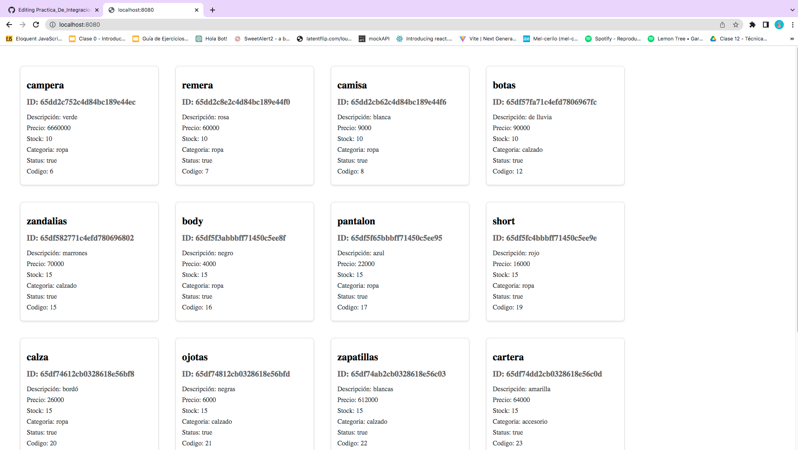
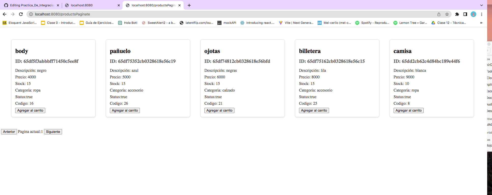
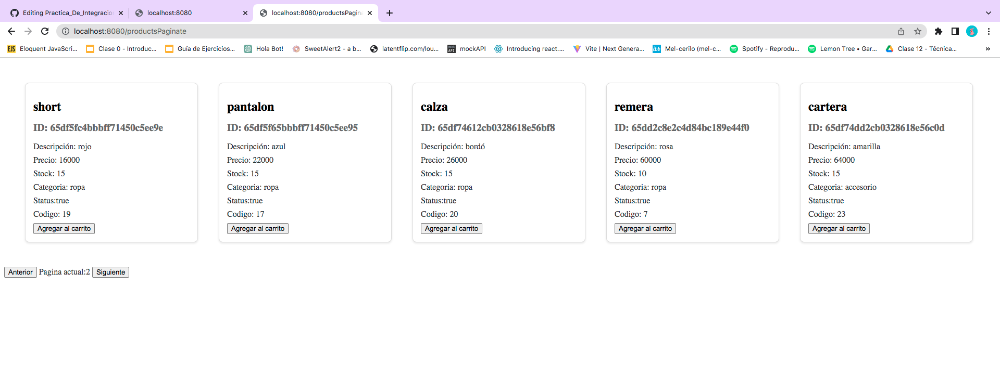
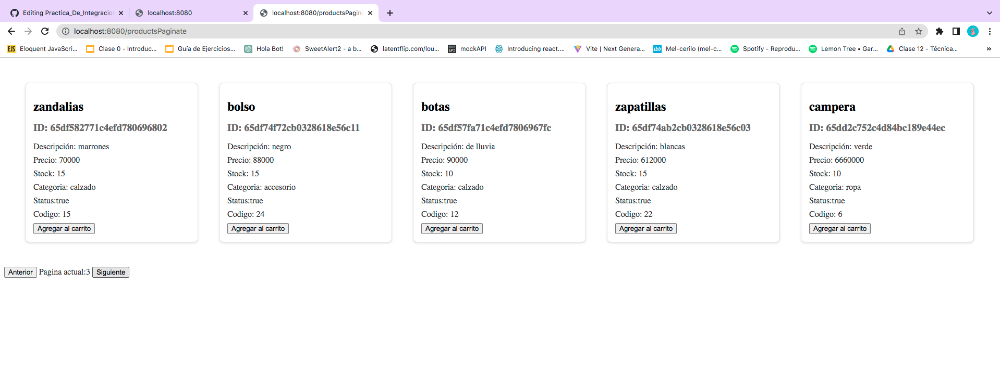

#Proyecto integrador

- Agregando cartId a usuario y ruta current para devolver en una respuesta el usuario actual. Video demostrativo:
  https://www.loom.com/share/259c026e43474098857e4256e0b0cb81?sid=7015fead-3132-44d7-9243-005416f8de98

- Agregando bcrypt, passport y login con Github. Video demostrativo:
  https://www.loom.com/share/733a466afab445aba37e6c90d4204c14?sid=35b7a1f6-2dd7-403e-b6ad-69aae80c704a

- Agregando cookies y session al proyecto. Video demostrativo:
  https://www.loom.com/share/63b4eed03e7b4b918f9d763891175f97?sid=148cbcf4-135e-4a31-9d34-fcee1977d20a

1- Servicio de productos.

- Devuelve todos los productos:
  

- Devuelve productos con limit
  

- Devuelve productos con limit y filtro por categoria
  

- Devuelve productos con limit, filtrado por categoria y pagina
  

- Devuelve un ordenamiento ascendente por precio
  

- Devuelve un ordenamiento descendente por precio
  

- Agrega producto
  

- No pudo agregarse un producto. El codigo esta repetido
  

- No pudo agregarse un producto. Faltan campos
  

- Modificación de producto
  

- Error en la modificación del producto. Por que no hay cambios
  

- Error en la modificación del producto. Por que faltan campos
  

- Devuelve producto por ID
  

- Error al no encontrar por ID
  

- Borrado de producto
  

- Error al querer borrar producto. No lo encuentra para eliminar
  

- VISTAS:

- http://localhost:8080
  

- PAGINACIÓN 1
  
- PAGINACIÓN 2
  
- PAGINACIÓN 3
  

- Carrito con sus productos
  
- El carrito mostrado en la vista existente en DB
  

2- Servicio para carrito

- Creación de un carrito
  

- Agrego producto al carrito
  

- Error. Si ingresa mal el ID del carrito donde quiero meter el producto
  

- Devuelve carrito por ID
  

- Error. Si no encuentra carrito por ID
  

- Devuelve todos los carritos
  

- Eliminación de un producto del carrito seleccionado
  

- Error. Querer eliminar un producto que no existe en el carrito seleccionado
  

- PRE eliminación de todos los productos del primer carrito
  

- Eliminación de TODOS los productos del carrito
  

- Muestro que los productos quedaron eliminados
  

- PRE MODIFICACIÓN de productos dentro del carrito seleccionado
  

- POST MODIFICACIÓN de productos dentro del carrito seleccionado
  

- MODIFICACIÓN APLICADA al carrito
  

- Modificación de la cantidad de productos en el carrito
  

- Visualización de la modificación de la cantidad aplicada
  

3- Servicio de mensajes mediante formulario

- Get messages
  

- Get message by ID
  

- Deleted message
  

4- Message sent from the form

